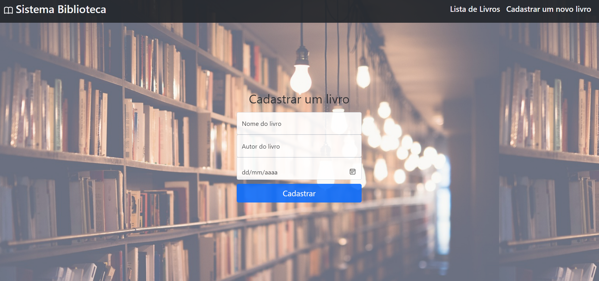

### Sistema Biblioteca

* Sistema criado com a finalidade de fazer o cadastro de livros no banco de dados MongoDB e trazer por meio de um filtro os dados cadastrados no banco para uma tabela no frontend.

<div>
    
</div>


### :rocket: Como executar
Para clonar o projeto em sua máquina, digite:

```
git clone https://github.com/camilacarvalhon/desafio_up_ti.git
```
<br>
<hr>

### :hammer_and_wrench: Ferramentas utilizadas

<ul>
    <li>Bootstrap 5</li>
    <li>Node.js</li>
    <li>MongoDB</li>
    <li>Express</li>
    <li>Mongoose</li>
</ul>

<br>
<hr>

### :wrench: Instalação

Instalação das dependêcias do projeto

```
npm i
```

### ⚙️ Executando Servidor e rodando com o live server

1º Vá ao terminal e digite:

```
npm run start
```

2º Acesse a página da aplicação e abra com o live server.


<br>
<hr>

### :black_nib: Criado por

**Camila Carvalho**  [Linkedin](https://www.linkedin.com/in/camilacarvalhon/)